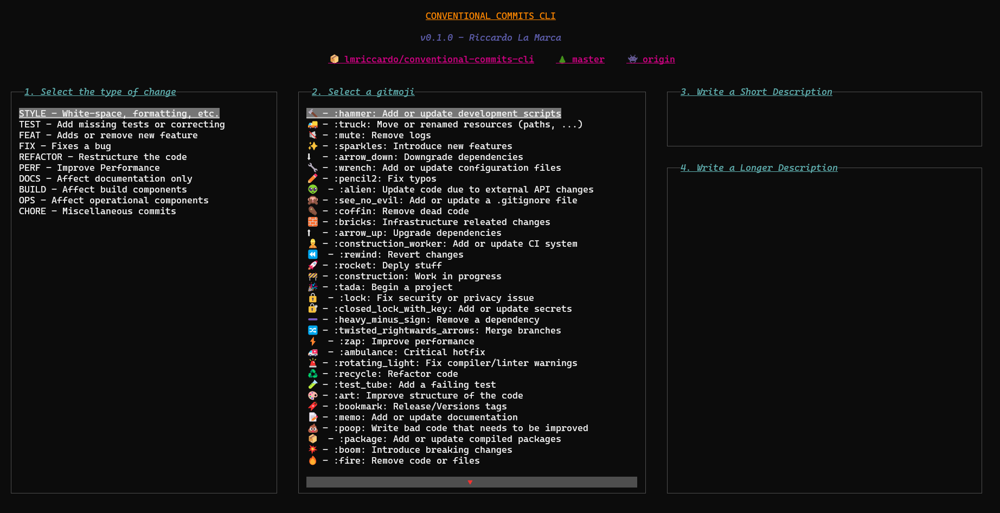

# Conventional Commits CLI Application

## ▶ Overview

This project aims to provide a simple and clean terminal application for git committing changes in "_conventional commit_"-like format. It also comes with automatic repository, current branch, repository branches and remotes detection. It, in some sense, follows the behavior of Visual Studio Code when committing and pushing using conventional commit. 

## ▶ CCommits UI

The following images shows the UI of Conventional Commits CLI.



There are 5 sections:

1. **Header**: it contains the name of the application, the version and the author name (me) and the current detected user repository, branch and remote.

2. **Type of change**: a multi-option selection box for selecting the type of the changes the user is going to commit

3. **Gitmoji**: a multi-option selection box for selecting the gitmoji

4. **Short description**: a textbox for the main description of the commit

5. **Long description**: a textbox for a longer description

These sections follows the same order of VS-code conventional commits, except for the _Scope_ and _BREAKING CHANGES_ sections that are missing in the current version.

> **Note**: when compiling the commit message you don't need to 
> follow neither the same order I gave to you nor the one 
> represented in the UI

### Moving inside the UI

Once you enter the UI no box has the focus, which means that you cannot select any option or write any characters in the textbox. A box became active whenever you give it the focus. Once you move from a box to another, the previous focused one lose the focus, which is gained by the new one.

There are two ways to give the focus to a box:

1. `MB1` (Mouse Button 1). This is the most straightforward one. Just click on a different box, the previous will lose its focus and the new one will gain it.

2. `Left/Right Arrow Keys`. It works only when no box has the focus at the moment. When pressed, the next box, in UI order, will gain the focus. To "deactivate" the current box just press `ESC`.

If you would like to use the second way for moving between the boxes, remember that it is always a combination of `Esc + L/R Arrow`. Here is some other useful commands:

| **Box**                  | **Command** | **Result**                                             |
|--------------------------|-------------|--------------------------------------------------------|
| _Multi-Option Selection_ | Up Arrow    | Move to the line above (if possible)                   |
|                          | Down Arrow  | Move to the line below (if possible)                   |
| _TextBox_                | Letter Key  | Add the pressed letter to the content                  |
|                          | Backspace   | Remove the current char                                |
|                          | Arrows      | Move the cursor where the pressed arrow is pointing to |

### Some Problems

The *Textbox* development is still in early stage development and provides just the required features to write a commit message. There are some bugs that needs to be fixed and improvemenets to be coded. Here is the list of some bugs:

- When the cursor is not at the end of the string, meaning that has been moved elsewhere inside the content, then writing new characters will delete what's next, essentially writing in *Insertion* mode by default.

- With the same condition of the previous bug, when deleting characters at some point gives *Index Out Of Bound Error*.

- When the window is resized its previous content will not be synched

- The ENTER Key not working in Textbox (I have decided to disable it for the moment and get back to it after the first release)

### Some Tips

Given the previous listed bugs, there are some tips that I can give you:

1. Before running the program resize the terminal to be almost the screen size. Do not keep the terminal dimension small, since there are some lines that needs to be displayed having a reasonable size.

2. Although they are available and working, do not use arrow keys in TextBox, since they can lead to a number of problems (the first two listed in the previous section)

## ▶ Installation and Usage

Installation is not required if using Docker containers.

```
docker run -it -v $(pwd):/app -w /app/ lmriccardo/ccommits-cli:latest
```

On the other hand it is possible to install it locally using _go_

```
go get github.com/lmriccardo/conventional-commits-cli@<version>
```

Up to now, the only possible version is `v0.1.0`. This will install a binary called `conventional-commits-cli` into the `$GOPATH/bin` folder, which is may be located at `$HOME/go/bin`. I suggest, first to rename the binary and then move it into `/usr/bin` if the `$GOPATH/bin` is not in your PATH. 

```
ln -s $GOPATH/bin/conventional-commits-cli /usr/bin/ccommits
```

Finally, call the executable

```
ccommits [-remote=<remote-name>]
```

It is also possible to download it from the _Releases_ page

## ▶ Conclusion

I would like to thank:

- [tcell](https://github.com/gdamore/tcell) for providing the baseline developement kit
- [conventional commits](https://github.com/conventional-commits/conventionalcommits.org) for providing, well, conventional commits, without which this project would have never been born